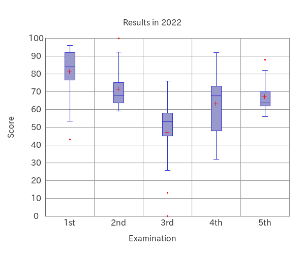
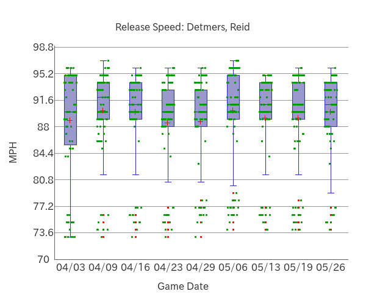
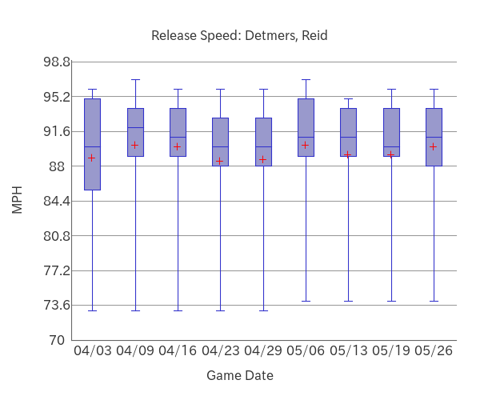
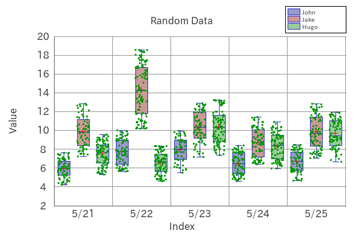

# PHP-Boxplot

PHP-Boxplot is easy to use for creating boxplots.

　


## Install

```bash
composer require macocci7/php-boxplot
```

## Usage

- PHP

    ```php
    <?php
    require('../vendor/autoload.php');

    use Macocci7\PhpBoxplot\Boxplot;

    $data = [
        '1st' => [75, 82, 96, 43, 78, 91, 84, 87, 93],
        '2nd' => [66, 74, 62, 100, 72, 68, 59, 76, 65],
        '3rd' => [56, 0, 45, 76, 58, 52, 13, 48, 54, 68],
        '4th' => [68, 32, 56, 92, 67, 72, 45, 76, 48, 73],
        '5th' => [70, 58, 62, 88, 62, 68, 56, 63, 64, 78],
    ];

    $bp = new Boxplot();

    $bp->setData($data)
        ->limit(0, 100)
        ->gridHeightPitch(10)
        ->gridVerticalOn()
        ->outlierOn()
        ->meanOn()
        ->labelX('Examination')
        ->labelY('Score')
        ->caption('Results in 2022')
        ->create('img/BoxplotExample.png');
    ```
- Result

    
    
## Example

- [BoxplotExample.php](example/BoxplotExample.php) >> results in:

    

- [DetmersReidBoxplot2023.php](example/DetmersReidBoxplot2023.php) >> results in:

    

    

- [BoxplotExampleCase.php](example/BoxplotExampleCase.php) >> results in:

    

## License

[MIT](LICENSE)

*Document created: 2023/05/28*

*Document updated: 2023/06/04*

Copyright 2023 macocci7
