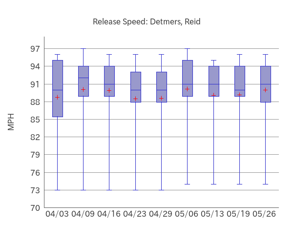
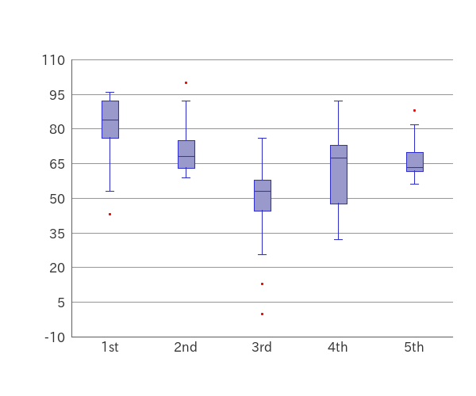

# PHP-Boxplot

## 1. Features

`PHP-Boxplot` is a PHP Library which is easy to use for creating boxplots.

`Outlier Detection` can be turned on/off.

`Plotting Mean`, `Plotting Jitter` and `Plotting Outliers` are available.

<table>
<tr>
<td></td>
<td></td>
</tr>
</table>　

Multiple datasets can be displayed side by side at the same time.

Legends can also be displayed.


Transparent background is also supported.


## Contents

- [1. Features](#1-features)
- 2\. Contents
- [3. Requirements](#3-requirements)
- [4. Installation](#4-installation)
- [5. Usage](#5-usage)
- [6. Examples](#6-examples)
- [7. LICENSE](#7-license)

## 3. Requirements

- PHP 8.1 or later
- Imagick PHP Extention
- Composer

## 4. Installation

```bash
composer require macocci7/php-boxplot
```

## 5. Usage

### 5.1. Basic Usage

- PHP: [examples/BasicUsage.php](examples/BasicUsage.php)

    ```php
    <?php

    require('../vendor/autoload.php');

    use Macocci7\PhpBoxplot\Boxplot;

    $data = [
        '1st' => [ 75, 82, 96, 43, 78, 91, 84, 87, 93, ],
        '2nd' => [ 66, 74, 62, 100, 72, 68, 59, 76, 65, ],
        '3rd' => [ 56, 0, 45, 76, 58, 52, 13, 48, 54, 68, ],
        '4th' => [ 68, 32, 56, 92, 67, 72, 45, 76, 48, 73, ],
        '5th' => [ 70, 58, 62, 88, 62, 68, 56, 63, 64, 78, ],
    ];

    $bp = new Boxplot();

    $bp->setData($data)
       ->create('img/BasicUsage.png');
    ```
- Result:

    

    - `Outlier Detection` is enabled by default.
    - `Outliers` are plotted as red dods.
    - The `Scale Range` is 10% larger than the `Data Range`.
    - Horizontal grid lines are drawn at intervals of 10% of the `Scale Range`.
    - The hash keys of the data are used as the labels for the X axis.

- Details:
    - Import Autoloader: `require_once('../vendor/autoload.php')`
    - Declare: `use Macocci7\PhpBoxplot\Boxplot`
    - Instantiate: `new Boxplot()`
    - Set Data: `setData($data)`
        - Acceptable Data Type: `array<int|string, array<int|float>>`
    - Create Image: `create($path)`

### 5.2. Adjusting Plot Area

- PHP:

    ```php
    <?php

    require('../vendor/autoload.php');

    use Macocci7\PhpBoxplot\Boxplot;

    $data = [
        '1st' => [ 75, 82, 96, 43, 78, 91, 84, 87, 93, ],
        '2nd' => [ 66, 74, 62, 100, 72, 68, 59, 76, 65, ],
        '3rd' => [ 56, 0, 45, 76, 58, 52, 13, 48, 54, 68, ],
        '4th' => [ 68, 32, 56, 92, 67, 72, 45, 76, 48, 73, ],
        '5th' => [ 70, 58, 62, 88, 62, 68, 56, 63, 64, 78, ],
    ];

    $bp = new Boxplot();

    $bp->setData($data)
       ->limit(0, 100)
       ->gridHeightPitch(20)
       ->gridVerticalOn()
       ->labels([ '#1', '#2', '#3', '#4', '#5', ])
       ->labelX('Achievement Test')
       ->labelY('Score')
       ->caption('Achievement Test Results in 2023')
       ->create('img/AdjustPlotArea.png');
    ```

- Result:

    

- Details:
    - Set Limits: `limit(int|float $lower, int|float $upper)`
    - Set Grid Pitch: `gridHeightPitch(int|float $pitch)`
    - Set Virtical Grid Visibility:
        - `gridVerticalOn()`
        - `gridVerticalOff()`
    - Set Labels: `labels(string[] $labels)`
    - Set Label for X Axis: `labelX(string $labelX)`
    - Set Label for Y Axis: `labelY(string $labelY)`
    - Set Caption: `caption(string $caption)`
## Examples

- [BoxplotExample.php](example/BoxplotExample.php) >> results in:

    

- [DetmersReidBoxplot2023.php](example/DetmersReidBoxplot2023.php) >> results in:

    

    

- [BoxplotExampleCase.php](example/BoxplotExampleCase.php) >> results in:

    

## License

[MIT](LICENSE)

*Document created: 2023/05/28*

*Document updated: 2023/11/25*

Copyright 2023 macocci7
