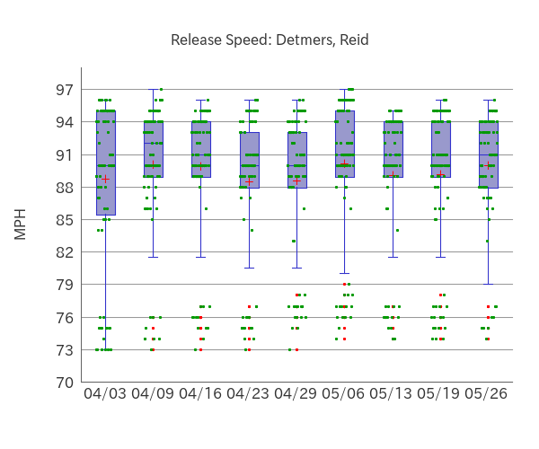
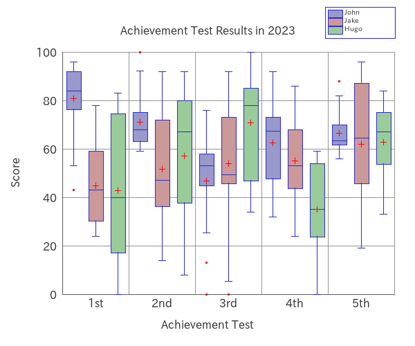
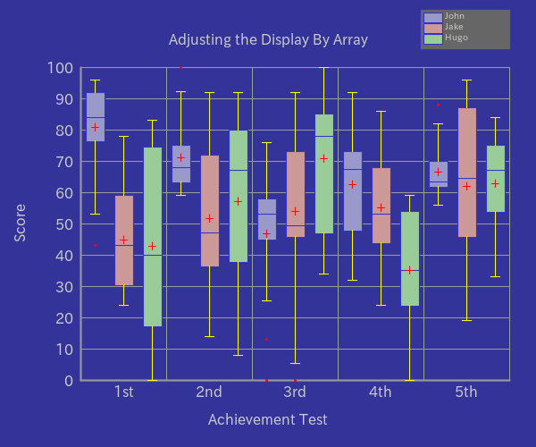
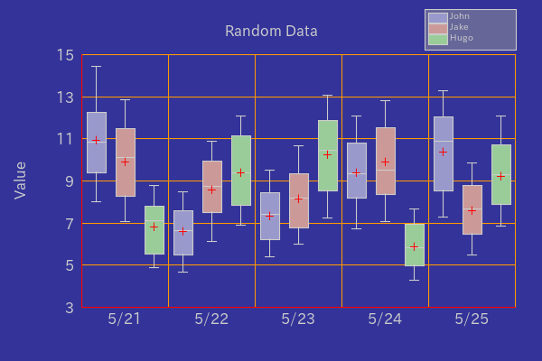

# PHP-Boxplot

## 1. Features

`PHP-Boxplot` is a PHP Library which is easy to use for creating boxplots.

`Outlier Detection` can be turned on/off.

`Plotting Mean`, `Plotting Jitter` and `Plotting Outliers` are available.

<table>
<tr>
<td></td>
<td></td>
</tr>
</table>　

Multiple datasets can be displayed side by side at the same time.

Legends can also be displayed.


Transparent background is also supported.


## Contents

- [1. Features](#1-features)
- 2\. Contents
- [3. Requirements](#3-requirements)
- [4. Installation](#4-installation)
- [5. Usage](#5-usage)
    - [5.1. Basic Usage](#51-basic-usage)
    - [5.2. Adjusting the Display By Methods](#52-adjusting-the-display-by-methods)
    - [5.3. Multiple Data Set](#53-multiple-data-set)
    - [5.4. Adjusting the Display By Neon File](#54-adjusting-the-display-by-neon-file)
    - [5.5. Adjusting the Display By Array](#55-adjusting-the-display-by-array)
    - [5.6. Transparent Background](#56-transparent-background)
- [6. Examples](#6-examples)
- [7. LICENSE](#7-license)

## 3. Requirements

- PHP 8.1 or later
- Imagick PHP Extension

    Check with commands:
    ```bash
    php -i | grep imagick
    ```
- Composer

## 4. Installation

```bash
composer require macocci7/php-boxplot
```

## 5. Usage

- [5.1. Basic Usage](#51-basic-usage)
- [5.2. Adjusting the Display By Methods](#52-adjusting-the-display-by-methods)
- [5.3. Multiple Data Set](#53-multiple-data-set)
- [5.4. Adjusting the Display By Neon File](#54-adjusting-the-display-by-neon-file)
- [5.5. Adjusting the Display By Array](#55-adjusting-the-display-by-array)
- [5.6. Transparent Background](#56-transparent-background)

### 5.1. Basic Usage

- PHP: [examples/BasicUsage.php](examples/BasicUsage.php)

    ```php
    <?php

    require_once __DIR__ . '/../vendor/autoload.php';

    use Macocci7\PhpBoxplot\Boxplot;

    $data = [
        '1st' => [ 75, 82, 96, 43, 78, 91, 84, 87, 93, ],
        '2nd' => [ 66, 74, 62, 100, 72, 68, 59, 76, 65, ],
        '3rd' => [ 56, 0, 45, 76, 58, 52, 13, 48, 54, 68, ],
        '4th' => [ 68, 32, 56, 92, 67, 72, 45, 76, 48, 73, ],
        '5th' => [ 70, 58, 62, 88, 62, 68, 56, 63, 64, 78, ],
    ];

    $bp = new Boxplot();

    $bp->setData($data)
       ->create('img/BasicUsage.png');
    ```
- Result:

    

    - `Outlier Detection` is enabled by default.
    - `Outliers` are plotted as red dods.
    - The `Scale Range` is 10% larger than the `Data Range`.
    - Horizontal grid lines are drawn at intervals of 10% of the `Scale Range`.
    - The hash keys of the data are used as the labels for the X axis.

- Details:
    - Import Autoloader: `require_once __DIR__ . '/../vendor/autoload.php'`
    - Declare: `use Macocci7\PhpBoxplot\Boxplot`
    - Instantiate: `new Boxplot()`
    - Set Data: `setData($data)`
        - Acceptable Data Type: `array<int|string, array<int|float>>`
    - Create Image: `create($path)`

### 5.2. Adjusting the Display By Methods

Adjusting Scale Size, Grid Pitch, Showing Vertical Grids,

Setting Labels for Each Boxplot, Labels for X Axis, Labels For Y Axis

And Setting Caption can be done as follows:

- PHP:

    ```php
    <?php

    require_once __DIR__ . '/../vendor/autoload.php';

    use Macocci7\PhpBoxplot\Boxplot;

    $data = [
        '1st' => [ 75, 82, 96, 43, 78, 91, 84, 87, 93, ],
        '2nd' => [ 66, 74, 62, 100, 72, 68, 59, 76, 65, ],
        '3rd' => [ 56, 0, 45, 76, 58, 52, 13, 48, 54, 68, ],
        '4th' => [ 68, 32, 56, 92, 67, 72, 45, 76, 48, 73, ],
        '5th' => [ 70, 58, 62, 88, 62, 68, 56, 63, 64, 78, ],
    ];

    $bp = new Boxplot();

    $bp->setData($data)
       ->limit(0, 100)
       ->gridHeightPitch(20)
       ->gridVerticalOn()
       ->meanOn()
       ->jitterOn()
       ->legendOn()
       ->labels([ '#1', '#2', '#3', '#4', '#5', ])
       ->labelX('Achievement Test')
       ->labelY('Score')
       ->caption('Achievement Test Results in 2023')
       ->legends(['Donald Biden'])
       ->create('img/AdjustDisplayByMethods.png');
    ```

- Result:

    

- Details:
    - Set Limits: `limit(int|float $lower, int|float $upper)`
    - Set Grid Pitch: `gridHeightPitch(int|float $pitch)`
    - Set Vertical Grid Visibility:
        - `gridVerticalOn()`
        - `gridVerticalOff()`
    - Set Labels: `labels(string[] $labels)`
    - Set Label for X Axis: `labelX(string $labelX)`
    - Set Label for Y Axis: `labelY(string $labelY)`
    - Set Caption: `caption(string $caption)`
    - Available Methods:

        Note: `$colorCode` must be in `#RGB` or `#RRGGBB` format.

        | Method | Detail |
        | :--- | :--- |
        |resize(int $width, int $height)|Resizes Canvas Size|
        |bgcolor(string $colorCode)|Sets Canvas Background Color|
        |fontColor(string $colorCode)|Sets Font Color|
        |axisColor(string $colorCode)|Sets Axis Color|
        |gridColor(string $colorCode)|Sets Grid Color|
        |boxBorder(int $width, string $colorCode)|Sets Box Border Color|
        |whisker(int $width, string $colorCode)|Sets Whisker Width and Color|
        |gridHeightPitch(int\|float $pitch)|Sets Grid Pitch|
        |boxWidth(int $width)|Sets Box Width|
        |boxBackground(array $colorCodes)|Sets Box Background Color Set|
        |labels(array $labels)|Sets Labels for Each Box|
        |labelX(string $label)|Sets Label for X Axis|
        |labelY(string $label)|Sets Label for Y Axis|
        |caption(string $caption)|Sets Caption|
        |legends(array $legends)|Sets Legend Labels|
        |legendBgcolor(string $colorCode)|Sets Legends Area Background Color|
        |gridVerticalOn()|Sets Visibility of Vertical Grid On|
        |gridVerticalOff()|Sets Visibility of Vertical Grid Off|
        |outlierOn()|Sets Outlier Detection On|
        |outlierOff()|Sets Outlier Detection Off|
        |jitterOn()|Sets Jitter Plot On|
        |jitterOff()|Sets Jitter Plot Off|
        |meanOn()|Sets Plotting Mean On|
        |meanOff()|Sets Plotting Mean Off|
        |legendOn()|Sets Displaying Legends On|
        |legendOff()|Sets Displaying Legends Off|

### 5.3. Multiple Data Set

Multiple datasets can be displayed side by side at the same time.

- PHP: [examples/MultipleDataSet.php](examples/MultipleDataSet.php)

    ```php
    <?php

    require_once __DIR__ . '/../vendor/autoload.php';

    use Macocci7\PhpBoxplot\Boxplot;

    $dataSet = [
        'John' => [
            '1st' => [75, 82, 96, 43, 78, 91, 84, 87, 93, ],
            '2nd' => [66, 74, 62, 100, 72, 68, 59, 76, 65, ],
            '3rd' => [56, 0, 45, 76, 58, 52, 13, 48, 54, 68, ],
            '4th' => [68, 32, 56, 92, 67, 72, 45, 76, 48, 73, ],
            '5th' => [70, 58, 62, 88, 62, 68, 56, 63, 64, 78, ],
        ],
        'Jake' => [
            'test#1' => [62, 35, 48, 43, 56, 78, 32, 24, 29, ],
            'test#2' => [37, 92, 56, 36, 14, 86, 41, 58, 47, ],
            'test#3' => [49, 83, 0, 48, 64, 73, 50, 46, 38, 92, ],
            'test#4' => [53, 44, 34, 51, 74, 68, 53, 86, 24, 66, ],
            'test#5' => [83, 61, 55, 96, 87, 46, 21, 19, 88, 68, ],
        ],
        'Hugo' => [
            'test01' => [73, 36, 0, 11, 40, 76, 24, 46, 83, ],
            'test02' => [69, 42, 76, 8, 92, 84, 45, 34, 67, ],
            'test03' => [100, 46, 34, 77, 85, 47, 91, 85, 66, 79, ],
            'test04' => [0, 14, 32, 24, 54, 44, 56, 32, 59, 38, ],
            'test05' => [69, 84, 65, 42, 33, 80, 74, 54, 75, 56, ],
        ],
    ];

    $bp = new Boxplot();
    $bp->setDataset($dataSet)
       ->limit(0, 100)
       ->gridHeightPitch(20)
       ->gridVerticalOn()
       ->legendOn()
       ->meanOn()
       ->labelX('Achievement Test')
       ->labelY('Score')
       ->caption('Achievement Test Results in 2023')
       ->create('img/MultipleDataSet.png');
    ```

- Result: [examples/img/MultipleDataSet.png](examples/img/MultipleDataSet.png)

    

- Details:
    - Set Data Set: `setDataset(array $dataSet)`
        - `$dataSet`: `array<int|string, array<int|string, array<int|float>>>`
    - The result of `array_keys($dataSet)` will be set as the legends.
        - In this case: [ 'John', 'Jake', 'Hugo', ] will be set as the legends.
    - The result of `array_keys($dataSet[array_keys($dataSet)[0]])` will be set as the labels.
        - In this case: [ '1st', '2nd', '3rd', '4th', '5th', ] will be set as the legends.
    - `legends(array $legends)` can overwrite legends.
    - `labels(array $labels)` can overwrite labels.

### 5.4. Adjusting the Display By Neon File

You can adjust the display by using Neon file.

First, prepare a Neon file like this:

- Neon: [examples/AdjustDisplayByNeon.neon](examples/AdjustDisplayByNeon.neon)

    ```neon
    # Configuration for BoxplotExample.php

    dataSet:
        'John': [
            1st: [75, 82, 96, 43, 78, 91, 84, 87, 93]
            2nd: [66, 74, 62, 100, 72, 68, 59, 76, 65]
            3rd: [56, 0, 45, 76, 58, 52, 13, 48, 54, 68]
            4th: [68, 32, 56, 92, 67, 72, 45, 76, 48, 73]
            5th: [70, 58, 62, 88, 62, 68, 56, 63, 64, 78]
        ]
        'Jake': [
            'test#1': [62, 35, 48, 43, 56, 78, 32, 24, 29]
            'test#2': [37, 92, 56, 36, 14, 86, 41, 58, 47]
            'test#3': [49, 83, 0, 48, 64, 73, 50, 46, 38, 92]
            'test#4': [53, 44, 34, 51, 74, 68, 53, 86, 24, 66]
            'test#5': [83, 61, 55, 96, 87, 46, 21, 19, 88, 68]
        ]
        'Hugo': [
            'test01': [73, 36, 0, 11, 40, 76, 24, 46, 83]
            'test02': [69, 42, 76, 8, 92, 84, 45, 34, 67]
            'test03': [100, 46, 34, 77, 85, 47, 91, 85, 66, 79]
            'test04': [0, 14, 32, 24, 54, 44, 56, 32, 59, 38]
            'test05': [69, 84, 65, 42, 33, 80, 74, 54, 75, 56]
        ]

    limitUpper: 100
    limitLower: 0

    #canvasWidth: 600
    #canvasHeight: 400
    canvasBackgroundColor: '#333399'
    #frameXRatio: 0.7
    #frameYRatio: 0.6

    axisColor: '#999999'
    axisWidth: 2

    #gridColor: '#cccccc'
    #gridWidth: 1

    gridHeightPitch: 10
    gridVertical: true

    #boxWidth: 20
    #boxBackgroundColors:
    #    - '#9999cc'
    #    - '#cc9999'
    #    - '#99cc99'
    #    - '#99cccc'
    #    - '#cc6666'
    #    - '#ffcc99'
    #    - '#cccc99'
    #    - '#cc99cc'
    #boxBorderColor: '#3333cc'
    #boxBorderWidth: 1

    whiskerColor: '#ffff00'
    #whiskerWidth: 1

    #fontPath: 'fonts/ipaexg.ttf' # IPA ex Gothic 00401
    #fontSize: 16
    fontColor: '#cccccc'

    outlier: true
    #outlierDiameter: 2
    #outlierColor: '#ff0000'

    #jitter: true
    #jitterColor: '#009900'
    #jitterDiameter: 2

    mean: true
    #meanColor: '#ff0000'

    #labels: [ '1st', '2nd', '3rd', '4th', '5th' ]
    labelX: 'Achievement Test'
    labelY: 'Score'
    caption: 'Adjusting the Display By Neon File'

    legend: true
    legendBackgroundColor: '#666666'
    #legends: [ 'John', 'Jake', 'Hugo', ]
    legendWidth: 100
    legendFontSize: 10

    # Default Color Set
    #colors:
    #    - '#9999cc'
    #    - '#cc9999'
    #    - '#99cc99'
    #    - '#99cccc'
    #    - '#cc6666'
    #    - '#ffcc99'
    #    - '#cccc99'
    #    - '#cc99cc'
    ```

Second, Code PHP like this:

- PHP: [examples/AdjustDisplayByNeon.php](examples/AdjustDisplayByNeon.php)

    ```php
    <?php

    require_once __DIR__ . '/../vendor/autoload.php';

    use Macocci7\PhpBoxplot\Boxplot;

    $bp = new Boxplot();
    $bp->config('AdjustDisplayByNeon.neon')
       ->create('img/AdjustDisplayByNeon.png');
    ```

Then, run the PHP Code.

- Result: [examples/img/AdjustDisplayByNeon.png](examples/img/AdjustDisplayByNeon.png)

    

### 5.5. Adjusting the Display By Array

You can Adjust the Display by using Array.

- PHP: [examples/AdjustDisplayByArray.php](examples/AdjustDisplayByArray.php)

    ```php
    <?php

    require_once __DIR__ . '/../vendor/autoload.php';

    use Macocci7\PhpBoxplot\Boxplot;

    $conf = [
        'dataSet' => [
            'John' => [
                '1st' => [75, 82, 96, 43, 78, 91, 84, 87, 93, ],
                '2nd' => [66, 74, 62, 100, 72, 68, 59, 76, 65, ],
                '3rd' => [56, 0, 45, 76, 58, 52, 13, 48, 54, 68, ],
                '4th' => [68, 32, 56, 92, 67, 72, 45, 76, 48, 73, ],
                '5th' => [70, 58, 62, 88, 62, 68, 56, 63, 64, 78, ],
            ],
            'Jake' => [
                'test#1' => [62, 35, 48, 43, 56, 78, 32, 24, 29, ],
                'test#2' => [37, 92, 56, 36, 14, 86, 41, 58, 47, ],
                'test#3' => [49, 83, 0, 48, 64, 73, 50, 46, 38, 92, ],
                'test#4' => [53, 44, 34, 51, 74, 68, 53, 86, 24, 66, ],
                'test#5' => [83, 61, 55, 96, 87, 46, 21, 19, 88, 68, ],
            ],
            'Hugo' => [
                'test01' => [73, 36, 0, 11, 40, 76, 24, 46, 83, ],
                'test02' => [69, 42, 76, 8, 92, 84, 45, 34, 67, ],
                'test03' => [100, 46, 34, 77, 85, 47, 91, 85, 66, 79, ],
                'test04' => [0, 14, 32, 24, 54, 44, 56, 32, 59, 38, ],
                'test05' => [69, 84, 65, 42, 33, 80, 74, 54, 75, 56, ],
            ],
        ],
        'limitUpper' => 100,
        'limitLower' => 0,
        'canvasBackgroundColor' => '#333399',
        'axisColor' => '#999999',
        'axisWidth' => 2,
        'gridHeightPitch' => 10,
        'gridVertical' => true,
        'whiskerColor' => '#ffff00',
        'fontColor' => '#cccccc',
        'outlier' => true,
        'mean' => true,
        'labelX' => 'Achievement Test',
        'labelY' => 'Score',
        'caption' => 'Adjusting the Display By Array',
        'legend' => true,
        'legendBackgroundColor' => '#666666',
        'legendWidth' => 100,
        'legendFontSize' => 10,
    ];

    $bp = new Boxplot();
    $bp->config($conf)
       ->create('img/AdjustDisplayByArray.png');
    ```

- Result: [examples/img/AdjustDisplayByArray.png](examples/img/AdjustDisplayByArray.png)

    

### 5.6. Transparent Background

You can set transparent background like this.

- PHP: [examples/TransparentBackground.php](examples/TransparentBackground.php)

    ```php
    <?php

    require_once __DIR__ . '/../vendor/autoload.php';

    use Macocci7\PhpBoxplot\Boxplot;

    $data = [
        '1st' => [75, 82, 96, 43, 78, 91, 84, 87, 93],
        '2nd' => [66, 74, 62, 100, 72, 68, 59, 76, 65],
        '3rd' => [56, 0, 45, 76, 58, 52, 13, 48, 54, 68],
        '4th' => [68, 32, 56, 92, 67, 72, 45, 76, 48, 73],
        '5th' => [70, 58, 62, 88, 62, 68, 56, 63, 64, 78],
    ];

    $bp = new Boxplot();

    $bp->setData($data)
       ->config([
        // This results in Transparent Background
        'canvasBackgroundColor' => null,
    ])
       ->limit(0, 100)
       ->gridHeightPitch(10)
       ->gridVerticalOn()
       ->outlierOn()
       ->meanOn()
       ->labelX('Examination')
       ->labelY('Score')
       ->caption('Transparent Background')
       ->create('img/TransparentBackground.png');
    ```

- Result: [examples/img/TransparentBackground.png](examples/img/TransparentBackground.png)

    

## Examples

- [BasicUsage.php](examples/BasicUsage.php) >> results in:

    <a href="examples/img/BasicUsage.png" target="_blank"></a>

- [AdjustDisplayByMethods.php](examples/AdjustDisplayByMethods.php) >> results in:

    <a href="examples/img/AdjustDisplayByMethods.png" target="_blank"></a>

- [AdjustDisplayByNeon.php](examples/AdjustDisplayByNeon.php) >> results in:

    <a href="examples/img/AdjustDisplayByNeon.png" target="_blank"></a>

- [AdjustDisplayByArray.php](examples/AdjustDisplayByArray.php) >> results in:

    <a href="examples/img/AdjustDisplayByArray.png" target="_blank"></a>

- [MultipleDataSet.php](examples/MultipleDataSet.php) >> results in:

    <a href="examples/img/MultipleDataSet.png" target="_blank"></a>

- [TransparentBackground.php](examples/TransparentBackground.php) >> results in:

    <a href="examples/img/TransparentBackground.png" target="_blank"></a>

- [DetmersReidBoxplot2023.php](examples/DetmersReidBoxplot2023.php) >> results in:

    <table>
    <tr>
    <td>
    <a href="examples/img/BoxplotDetmersReid2023_01.png" target="_blank"></a>
    </td>
    <td>
    <a href="examples/img/BoxplotDetmersReid2023_02.png" target="_blank"></a>
    </td>
    </tr>
    </table>

- [BoxplotExampleCase.php](examples/BoxplotExampleCase.php) >> results in:

    <a href="examples/img/BoxplotExampleCase.png" target="_blank"></a>

## License

[MIT](LICENSE)

***

*Document created: 2023/05/28*

*Document updated: 2025/01/02*

Copyright 2023 - 2025 macocci7
